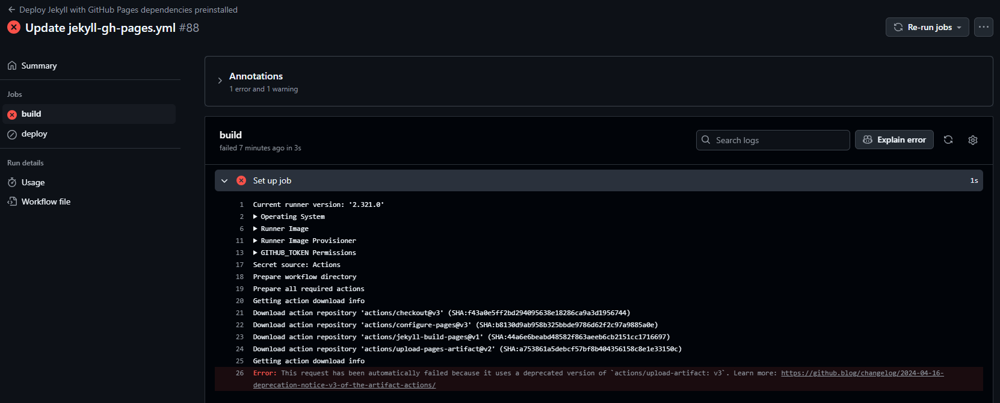

# Erkenntnisse

Dieses Kapitel widmet sich der Reflexion meiner Semesterarbeit. Dabei gehe ich auf meine persönlichen Erfahrungen, mein Verhalten und den Umgang mit Herausforderungen ein.

[Quelle](../Quellverzeichnis/index.md#erkenntnisse) 

## Herausforderungen / Probleme

### Github CI/CD Pipeline für Github Pages

In dieser Arbeit habe ich erstmals mit einer CI/CD-Pipeline gearbeitet, was für mich eine völlig neue Erfahrung war. Mein Arbeitskollege brachte mich mit diesem Konzept in Kontakt, und ich fand die Idee äußerst spannend. Bereits im Rahmen des Projektmanagements, vorgestellt durch Philipp, wurde der Begriff "Github Pages" erwähnt, aber ich hatte zunächst keine konkrete Vorstellung davon.

Da dies meine erste Arbeit mit Github Pages war, habe ich meinen Arbeitskollegen um Unterstützung gebeten, und gemeinsam konnten wir die Grundstruktur der Pipeline aufbauen. Im Verlauf der Arbeit konnte ich dann weitere Details eigenständig umsetzen.

Gegen Ende der Arbeit gab es allerdings einen unerwarteten Schreckmoment: Während des Pushens erhielt ich eine Fehlermeldung beim Deployment. Nach ausführlicher Recherche stieß ich auf ein bekanntes Problem, das viele betraf. Das verwendete Tool für das Deployment wird ab dem 31. Januar eingestellt. Um die Nutzer frühzeitig darauf aufmerksam zu machen, wurden sogenannte "Brownouts" eingeplant, bei denen Deployments absichtlich scheiterten, um die Warnung zu verdeutlichen. Leider ist das Nachfolge-Tool noch nicht vollständig funktionsfähig, weshalb ich aktuell bei der bestehenden Version bleibe. Hier ist der Link zur entsprechenden Informationsseite:  
[Deprecation Notice (reminder): v3 of the artifact actions 📣 (updated) · community · Discussion #142581](https://github.com/orgs/community/discussions/142581)

Im folgenden Bild ist die Fehlermeldung zu sehen, die während des Brownouts auftrat:

### Camunda

Bei der Arbeit mit Camunda hatte ich anfangs Schwierigkeiten mit den Message-Events und Signalen. Dank der Unterstützung von Thomas, der mir hilfreiche Tipps gab, konnte ich diese Probleme erfolgreich bewältigen und meine Kenntnisse in diesem Bereich erweitern.

### Skripte

Bei der Erstellung von Skripten hatte ich Herausforderungen im Zusammenhang mit der Validierung und der Datenübernahme aus Camunda. Diese Probleme konnte ich jedoch durch gezielte Recherche und den Einsatz von ChatGPT lösen. Ich habe mich bewusst auf PowerShell konzentriert, da ich im Alltag häufiger mit PowerShell arbeite als mit Python. Auch in meinem Unternehmen wird PowerShell bevorzugt eingesetzt, weshalb die Nutzung reiner Python-Skripte die Prozesse unnötig verkompliziert hätte.

### Lessons Learned

Durch diese Arbeit konnte ich mein Fachwissen in PowerShell und Camunda deutlich erweitern. Allerdings hätte ich mich zu Beginn besser mit Camunda und Python vertraut machen sollen, da die Integration mit PowerShell anspruchsvoller war, als ich erwartet hatte. Außerdem trat ein einkalkuliertes Risiko ein, das ich zwar berücksichtigt hatte, jedoch wäre es hilfreich gewesen, eine alternative Lösung zu finden, anstatt auf eine lokale Lösung zurückzugreifen.

## Reflexion der ganzen Semesterarbeit

Während meiner zweiten Semesterarbeit konnte ich viele wertvolle Erfahrungen sammeln und bemerkenswerte Fortschritte erzielen. Dennoch lief nicht alles reibungslos. Gegen Ende der Bearbeitung geriet ich leider in Zeitnot, was vor allem auf unerwartete Probleme in den Skripten und meinen starken Fokus auf technische Details zurückzuführen war. Diese Herausforderungen haben mir verdeutlicht, wie wichtig es ist, noch präziser zu planen und Prioritäten zu setzen.

Trotz dieser Hürden bin ich stolz darauf, dass ich die Dokumentation wie geplant auf GitHub Pages hosten konnte. Dieses Ziel zu erreichen, hat mir nicht nur Freude bereitet, sondern auch meine Fähigkeiten im technischen Bereich weiter gestärkt. Aufgrund der positiven Erfahrung werde ich künftige Semesterarbeiten voraussichtlich ebenfalls auf GitHub Pages veröffentlichen.

Die Arbeit mit der Qualitätsmanagement-Methode Six Sigma, die für mich neu war, hat sich als äusserst lehrreich erwiesen. Obwohl es eine Herausforderung war, habe ich die Methode erfolgreich angewendet und konnte den internen Prozess „Personaleintritt“ aktualisieren und visualisieren. Diese strukturierte Herangehensweise hat mir gezeigt, wie wichtig klare Methoden in der Praxis sind.

Auch das Arbeiten mit Camunda hat mir viel Spass gemacht, und ich konnte mein Wissen in diesem Bereich deutlich erweitern. Ich hoffe, dass ich bei uns intern dieses Tool und auch die Vorgehensweise einbringen kann. 

Insgesamt betrachte ich die zweite Semesterarbeit trotz der zeitlichen Engpässe am Ende als einen Erfolg. Sie hat mir nicht nur geholfen, mein technisches Wissen zu erweitern, sondern mich auch in meiner Arbeitsweise und in meiner persönlichen Entwicklung gestärkt.

___ 
### Dankbarkeit

Ich möchte mich herzlich bei meinen Arbeitskollegen, insbesondere [Dennis Buathong](https://github.com/Bazzako) & [Mathieu Simon](https://github.com/matsimon) , und bei [Thomas Kälin](https://github.com/tkaelin) (Fachexperte) bedanken, die mich während dieser Arbeit unterstützt haben. Ihre Geduld, Expertise und Hilfsbereitschaft haben wesentlich dazu beigetragen, dass ich die Herausforderungen meistern und neue Kenntnisse erwerben konnte.