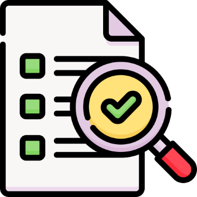

# Abschluss

Im Kapitel "Abschluss" werde ich eine ausführliche Reflexion meiner im Rahmen des Projekts gesammelten Erfahrungen vornehmen. Dabei werde ich die Herausforderungen detailliert darlegen, denen ich während der Bearbeitung der Semesterarbeit begegnet bin, und beschreiben, wie ich mit diesen Problemen umgegangen bin. Zusätzlich werde ich die Erkenntnisse hervorheben, die ich aus diesen Erfahrungen gewonnen habe, sowie aufzeigen, inwiefern diese mich persönlich und fachlich weitergebracht haben.

[Quelle](../Quellverzeichnis/index.md#abschluss) 