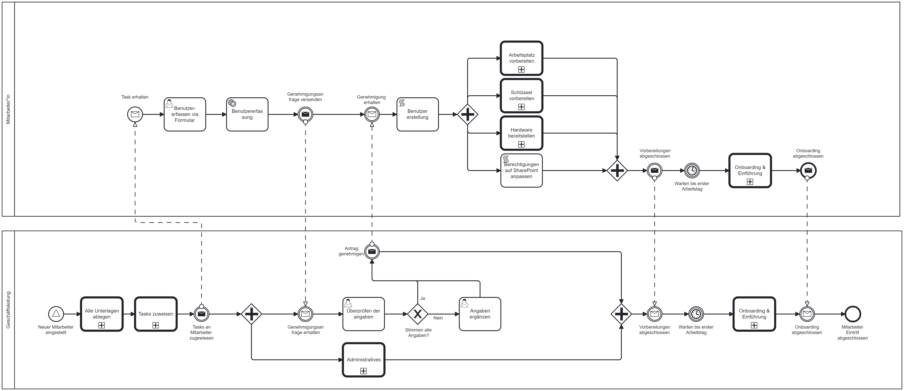
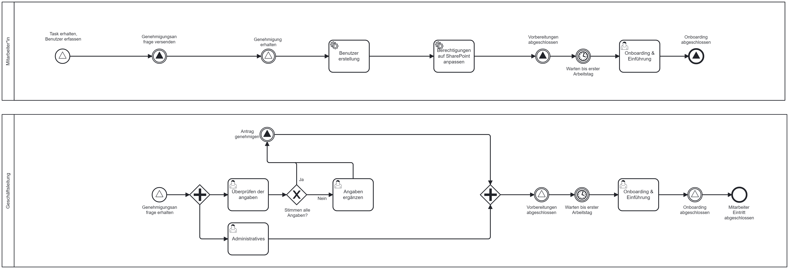
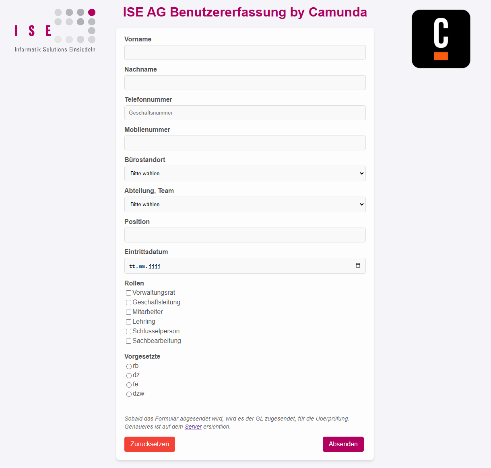
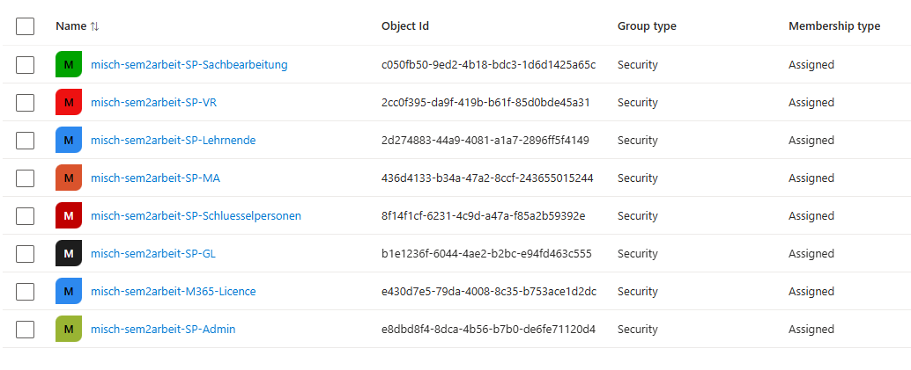

#  Verbessern (Improve) Phase

Die Improve-Phase ist der vierte Schritt in einem Six Sigma Projekt. In dieser Phase werden die in der [Analyze-Phase](./33_analysieren.md) identifizierten Hauptursachen für Prozessabweichungen adressiert und Lösungen entwickelt, um diese zu beheben. Ziel ist es, durch gezielte Verbesserungsmassnahmen die Prozessleistung zu optimieren und die identifizierten Probleme nachhaltig zu lösen. Dies umfasst die Anwendung von Kreativitätstechniken, statistischen Methoden und Pilotprojekten, um die Wirksamkeit der vorgeschlagenen Lösungen zu testen und zu validieren.

[Quelle](../Quellverzeichnis/index.md#improve-phase)

## Was ist Camunda?
 

[Quelle](../Quellverzeichnis/index.md#camunda-logo)

Camunda ist eine leistungsstarke Softwareplattform, die Unternehmen dabei unterstützt, ihre Geschäftsprozesse effizient zu steuern. Sie bietet umfassende Funktionen für das Business Process Management (BPM) und die Automatisierung von Workflows.

Im Bereich BPM ermöglicht Camunda die Modellierung, Ausführung und Überwachung von Geschäftsprozessen. Ziel ist es, Geschäftsabläufe systematisch zu analysieren und zu optimieren, um die Effizienz und Effektivität der Organisation zu steigern.

Ein herausragendes Merkmal von Camunda ist die Fähigkeit zur Automatisierung von Workflows. Unternehmen können spezifische Regeln und Bedingungen festlegen, um Geschäftsprozesse automatisch ablaufen zu lassen. Dies reduziert menschliche Fehler und sorgt für konsistente Abläufe.

Zusätzlich bietet die Plattform Werkzeuge zur visuellen Modellierung von Prozessen. Dies ermöglicht den Benutzern, einen klaren Überblick über die Struktur und den Ablauf von Aufgaben innerhalb des Unternehmens zu erhalten. Diese Modelle dienen als Grundlage für die Implementierung automatisierter Workflows.

Insgesamt hilft Camunda Unternehmen dabei, ihre Geschäftsprozesse effizienter zu gestalten und eine bessere Kontrolle über ihre Abläufe zu erlangen.

## Umsetzung (Improve)
Ich konnte die Checkliste erfolgreich durch ein Camunda-BPMN ersetzen. Ich habe alle analysierten Probleme erkannt und behoben. Das ganze habe ich mit dem Camunda Modeler umgesetzt.

Das *Know-how* habe ich mir durch meine aktive Teilnahme am BPM-Unterricht bei Thomas Kälin sowie durch das Studium des Praxishandbuchs angeeignet:
*BPMN von Jabok Freund und Bernd Rücker - Mit Einführung in DMN, 6. Auflage*
[Praxishandbuch BPMN](https://www.hanser-elibrary.com/doi/epdf/10.3139/9783446461123.fm)

Unterhalb der folgenden Grafik zeige ich auf, wie der **Personaleintrittsprozess** logisch aussehen würde. Diese Darstellung gibt eine klare und verständliche Übersicht über den idealen Ablauf:

Falls das Bild ungenau oder zu klein angezeigt wird, finden Sie [hier](../../ressources/images/personaleintrittsprozess_logical.svg) die vollständige SVG-Datei in besserer Auflösung.

### Weshalb ein logischer Prozess?
Ein logischer Prozess bietet eine abstrakte Sicht auf den Ablauf, die frei von technischen Einschränkungen ist. Während der Arbeit am **Camunda-Prozess** musste ich jedoch feststellen, dass technische Anforderungen einige Anpassungen notwendig machten, die aus der rein logischen Perspektive nicht immer unmittelbar nachvollziehbar waren.

Aus diesem Grund habe ich einen zweiten Prozess erstellt: den **technischen Prozess**. Dieser stellt den tatsächlichen Ablauf dar, so wie er in Camunda umgesetzt wurde:

Falls das Bild ungenau oder zu klein angezeigt wird, finden Sie [hier](../../ressources/images/personaleintrittsprozess_tecnical.svg) die entsprechende SVG-Datei in besserer Auflösung.

### Vergleich beider Prozesse
Beim Vergleich der beiden Prozesse fällt ein signifikanter Unterschied in der Handhabung der **Intermediate Events** auf. Im logischen Modell würde der Prozess mit **Messages** arbeiten, da diese die Kommunikation zwischen den verschiedenen Prozessschritten intuitiv abbilden.

Während der Tests im technischen Prozess stellte ich jedoch fest, dass die **Token** bei jedem **Catch-Event** gestoppt wurden. Nach einer Recherche stiess ich auf ähnliche Berichte von Nutzern, die ebenfalls auf dieses Problem gestossen sind. Die empfohlene Lösung war der Wechsel von **Messages** zu **Signalen**, weshalb ich diesen Ansatz ebenfalls übernommen habe. 
Dies ist der Link zu diesem Forum: 
[Message Event (throw and catch problem)| JBoss.org Content Archive (Read Only)](https://developer.jboss.org/thread/176562) 

### Call-Activities
Vorab als Erklärung, die fett umrandeten Tasks werden als **Aufruf-Aktivitäten** oder **Call-Activities** bezeichnet. Sie stehen für global definierte Prozesse oder Aufgaben, die im aktuellen Prozess eingebunden sind.
Der Einsatz von Call-Activities hat mehrere Vorteile:

- Wiederverwendbarkeit von Prozessbausteinen.
- Reduzierung der Komplexität im Hauptprozess.
- Klare Trennung zwischen übergeordnetem und untergeordnetem Prozess.

Diese Methode wurde gewählt, da die detaillierte Beschreibung dieser Prozesse den Rahmen der Semesterarbeit überschreiten würde.

### Camunda Container
Um interaktiv mit dem erstellten Camunda BPMN-Modell zu arbeiten, wird ein **Docker-Container** bereitgestellt. Dieser Container ermöglicht das Starten und Verwalten von Prozessinstanzen direkt auf dem lokalen System und bietet zudem interaktive Funktionen, um den Prozessverlauf zu steuern und zu beobachten.

**Hauptfunktionen des Containers:**
- **Prozessinstanzen starten:** Neue Instanzen können direkt initiiert werden.
- **Statusüberwachung:** Der aktuelle Fortschritt und Zustand der Prozessinstanzen ist jederzeit nachvollziehbar.
- **Interaktive Steuerung:** Benutzer können manuell in den Prozess eingreifen, indem sie Aufgaben abschliessen oder Signale senden.

Derzeit wird der Container lokal betrieben. Langfristig ist jedoch geplant, ihn auf **Azure** zu hosten. Dies bietet mehrere Vorteile:

- **Skalierbarkeit:** Automatische Anpassung an wachsende Anforderungen.
- **Cloudbasierte Verfügbarkeit:** Erreichbarkeit unabhängig vom lokalen System.
- **Einfachere Wartung:** Zentralisierte Verwaltung, vereinfachte Updates und nahtlose Integration in bestehende Cloud-Infrastrukturen.

Diese Lösung schafft eine robuste Basis für die Prozessautomatisierung und verbessert sowohl die Benutzererfahrung als auch die langfristige Wartbarkeit.

### REST API – Camunda Platform REST API
Um Prozesse effizient zu steuern, wird die [**Camunda Platform REST API**](http://localhost:8080/swaggerui/) verwendet. 
_(Die API funktioniert nur wenn auch der Camunda Server läuft)_

Diese Schnittstelle ermöglicht:

- Das Auslösen von Ereignissen.
- Die direkte Steuerung von Prozessen.
- Das Testen von Interaktionen über die Swagger UI.

Besonders hilfreich ist die Swagger UI, die eine einfache und intuitive Bedienung bietet, um während der Entwicklung schnell auf Änderungen oder Fehler zu reagieren.

### Formular
In meiner ursprünglichen Planung wollte ich ein Camunda-Formular verwenden. Während der Implementierung stellte sich jedoch ein Problem heraus: Beim Absenden des Formulars blieb das **Eintrittsdatum** leer, und die Übermittlung funktionierte nicht korrekt.

Dieses Problem wurde bereits im [Gespräch mit Thomas](../Sprints/besprechung_bpmn_23-12-2024.md) diskutiert, jedoch konnte kurzfristig keine Lösung gefunden werden. Daher habe ich mich entschieden, eine alternative Lösung umzusetzen.

Nun verwende ich ein **HTML-Formular**, das beim Absenden eine neue Prozessinstanz startet und die erforderlichen Werte direkt mitliefert:

*Das vollständige HTML-File kann [hier](../../ressources/scripts/Webform.html) eingesehen werden.*

Die Übermittlung der Formular-Daten erfolgt über einen **API-Call**, der das Signal `Start_new_employee` sendet. Dieses Signal startet eine neue Prozessinstanz und übergibt die Formularwerte zur weiteren Verarbeitung.

### Signale
Im [technischen Prozess](../../ressources/images/personaleintrittsprozess_tecnical.svg) habe ich den Ansatz gewählt, weiterhin mit **Intermediate Events** zu arbeiten, jedoch von **Messages** auf **Signale** umzusteigen, die von Camunda versendet werden. Dieser Wechsel ermöglicht mehr Flexibilität und eine klarere Trennung der Aufgaben im Prozessmodell.

**Signal Intermediate Events** lauschen auf spezifische Signale, die für unterschiedliche Prozessschritte definiert sind. Sobald ein Signal ausgelöst wird, aktiviert es gezielt den nächsten Schritt im Prozess. Dieser Mechanismus sorgt nicht nur für eine reibungslose Koordination der Aufgaben, sondern ermöglicht auch eine bessere Skalierbarkeit und Nachvollziehbarkeit.

Die Signale sind den folgenden Tasks zugeordnet und dienen als zentrale Steuerungselemente für deren Ausführung:

| **Signalname**             | **Typ**                                   | **Beschreibung**                                                                                                |
| -------------------------- | ----------------------------------------- | --------------------------------------------------------------------------------------------------------------- |
| `Start_new_employee`       | Start Event (Signal)                      | Signal, das von der API gesendet wird, um eine neue Prozessinstanz zu starten.                                  |
| `employee_send_request`    | Intermediate Event & Start Event (Signal) | Signal, das die Anfrage zur Genehmigung an die GL sendet.                                                       |
| `gl_approve_request`       | Intermediate Event (Signal)               | Signal, das signalisiert, dass die Geschäftsleitung (GL) den Antrag genehmigt hat.                              |
| `employee_preps_done`      | Intermediate Event (Signal)               | Signal, das meldet, dass der Benutzer erstellt wurde und den SharePoint-Gruppen hinzugefügt wurde.              |
| `employee_onboarding_done` | End Event & Intermediate Event  (Signal)  | Signal, das das Ende des Onboardings markiert und den Abschluss des Prozesses beim Mitarbeitenden signalisiert. |

Dieser Ansatz verbessert nicht nur die Lesbarkeit und Wartbarkeit des Modells, sondern minimiert auch potenzielle Fehlerquellen, da Signalmechanismen eine klare Trennung zwischen Sender und Empfänger sicherstellen.

### Service Tasks
Ein **Service Task** ist ein automatisierter Prozessschritt, der eine Aufgabe ohne menschliche Interaktion ausführt. Er wird typischerweise verwendet, um Skripte, APIs oder Systemaufrufe zu starten.

#### Einsatz in meinem Projekt
In meinem Projekt verwende ich **zwei Service Tasks**, um technische Aufgaben im Prozess automatisiert auszuführen:

1. **Benutzererstellung mit PowerShell-Skript**  
    Im ersten PowerShell-Skript habe ich die **Benutzererstellung** umgesetzt. Der Fokus liegt auf den folgenden Schritten:
    
    1. Abfrage mit der **Camunda REST API**, ob ein Service Task ausgelöst wurde.
    2. Abruf von Variablen aus Camunda und Speichern dieser in lokale Variablen im Skript.
    3. Import der Login-Daten für die **Microsoft Graph API** (JSON-File nur auf dem Host verfügbar).
    4. Anmeldung bei der Microsoft Graph API über PowerShell mithilfe einer **App Registration**.
    5. Benutzererstellung:
        - Überprüfung des **UserPrincipalName (UPN)**, ob dieser bereits existiert.
        - Erstellung eines **MailNicknames**.
        - Generierung eines Passworts mithilfe eines Passwort-Generators.
        - Evaluierung des **Departments** (Abteilung).
        - Erstellung des Benutzers mit den ermittelten Informationen.
        - Rückgabe des Passworts und UPN für ein mögliches Login-Blatt.
    6. Hinzufügen des Benutzers zur **Lizenzgruppe**.
    7. Zuordnung eines Managers für das Organigramm:
        - Evaluierung des Managers.
        - Auffinden des Manager-Objekts.
        - Umwandlung des Manager-Objekts in ein **OData-Objekt**.
        - Hinzufügen des Managers zum Benutzer.
    8. Abschluss des Tasks: Rückgabe von Werten an Camunda (**UPN** und **Passwort**).
    
    *Das vollständige Skript kann [hier](https://github.com/Radball-Migi/HF-ITCNE24-SemArbeit2-BPMN-Personalprozess/blob/main/ressources/scripts/MgGraph_User_Creation.ps1) eingesehen werden.*
     

2. **SharePoint-Zugriffsrechte vergeben mit PowerShell**  
    Im zweiten PowerShell-Skript werden die Zugriffsrechte des Benutzers konfiguriert. Während in vielen Unternehmen Zugriffsrechte für Laufwerke, Server, Tools oder ähnliche Ressourcen eingerichtet werden, konzentriere ich mich auf **SharePoint**. Da ich in meiner Arbeit bevorzugt mit SharePoint anstelle von klassischen Server-Laufwerken arbeite, liegt hier der Schwerpunkt. Ein zusätzlicher Vorteil von SharePoint ist die Nutzung als **Cloudspeicher**, der flexiblen und ortsunabhängigen Zugriff ermöglicht.
    
    Das Skript ist im Vergleich zur Benutzererstellung kompakter, da der Fokus auf der **Gruppenzuweisung** liegt. Es umfasst die folgenden Schritte:
    
    1. Abfrage mit der **Camunda REST API**, ob ein Service Task ausgelöst wurde.
    2. Abruf von Variablen aus Camunda und Speichern dieser in lokale Variablen im Skript.
    3. Import der Login-Daten für die **Microsoft Graph API** (JSON-File nur auf dem Host verfügbar).
    4. Anmeldung bei der Microsoft Graph API über PowerShell mithilfe einer **App Registration**.
    5. Konvertierung der Rollenzuweisung aus Camunda in ein **System-Array**.
    6. Gruppenzuweisung:
        - Zuweisung des Benutzers zu den Gruppen, die für die jeweiligen Rollen definiert sind.
    7. Abschluss des Tasks: Es erfolgt keine Werte-Rückgabe an Camunda.
    
    *Das vollständige Skript kann [hier](https://github.com/Radball-Migi/HF-ITCNE24-SemArbeit2-BPMN-Personalprozess/blob/main/ressources/scripts/MgGraph_SP_adjust_permissions.ps1) eingesehen werden.* 
    

> ℹ️ **Info:**  
> Beide Skripte sind ausführlich kommentiert, sodass jeder Schritt leicht nachvollziehbar ist.  
> Die Vorlage für die Abfrage mit der **Camunda REST API**, ob ein Task vorhanden ist, wurde von Thomas bereitgestellt und als Grundlage verwendet.

> Die Skripte werden derzeit lokal auf dem Notebook ausgeführt, da es Probleme mit der Zertifikatsanmeldung auf dem Camunda-Server gab. Um keine unnötige Zeit mit der Behebung dieses Problems zu verlieren, habe ich mich entschieden, die Skripte vorerst lokal zu starten. Sobald die Zertifikatsanmeldung gelöst ist, werde ich die Skripte entsprechend integrieren und anpassen.

>Bei beiden Skripts wurde ein Teil von Thomas Skriptvorlage übernommen, welche die Abfrage des Tasks durchführt. Alles andere an den Scripts wurde selbst geschrieben.
>Link zum Skript: [ExternalTask_DoWork.ps1 by Thomas Kälin](https://gitlab.com/ch-tbz-it/Stud/m254/-/blob/main/Unterlagen/Camunda7/Beispiele/Aufg_ExternalTask/ExternalTask_DoWork.ps1) 
>Dieser Skriptausschnitt wurde im Gespräch mit Thomas angeschaut und zur Übernahme freigegeben.

 

#### **SharePoint**
Der **SharePoint** dient als zentraler Datenspeicher und umfasst nicht nur die Speicherung persönlicher Daten (OneDrive), sondern auch Daten, die traditionell auf Netzlaufwerken liegen könnten. Doch der SharePoint kann weit mehr als nur Daten speichern.

In meiner Semesterarbeit nutzen wir den SharePoint beispielsweise als Speicherort für Anleitungen, als Inventar, für Kundenseiten, Prozesslandschaften und viele weitere Anwendungen. Er ist ein vielseitiges Tool, das unterschiedliche Anforderungen in einer zentralisierten Umgebung abdeckt.

##### Berechtigungsvergabe

In einem Unternehmen ist es essenziell, dass nicht jeder Zugriff auf dieselben Inhalte hat, um sensible Daten zu schützen. So haben beispielsweise die Geschäftsleitung, Mitarbeitende und Lernende unterschiedliche Berechtigungen. Dieser Berechtigungsaufbau kann mit der Struktur eines Laufwerks verglichen werden.

Auf dem SharePoint können Berechtigungen direkt an einzelne Personen vergeben werden. Doch dies ist in der Praxis nicht effizient, da es mit einem hohen administrativen Aufwand verbunden ist. Daher setzt man besser auf Gruppen.

Es gibt zwei Ansätze für die Gruppenzuweisung:

1. **SharePoint-Gruppen:** Diese müssen für jede Site einzeln erstellt und gepflegt werden. Kommt eine neue Person hinzu, muss diese manuell auf allen relevanten Sites ergänzt werden. Dies führt zu einem erheblichen Mehraufwand bei der Verwaltung.
2. **Entra ID-Gruppen (ehemals Azure AD-Gruppen):** Diese Gruppen können zentral verwaltet und auf allen SharePoint-Sites verwendet werden. Änderungen, wie das Hinzufügen oder Entfernen von Mitgliedern, werden automatisch auf alle verbundenen Sites angewendet.

In meiner Arbeit und auch in der Firma bevorzugen wir den zweiten Ansatz mit **Entra ID-Gruppen**, da er den Verwaltungsaufwand minimiert und gleichzeitig eine konsistente Berechtigungsstruktur gewährleistet.

Für meinen SharePoint habe ich spezifische Entra ID-Gruppen erstellt, die nach einem klaren Schema benannt sind:

- `misch-sem2arbeit-SP-VR` – für Verwaltungsräte
- `misch-sem2arbeit-SP-Lehrnende` – für Lernende
- `misch-sem2arbeit-SP-MA` – für Mitarbeitende
- `misch-sem2arbeit-SP-Schluesselpersonen` – für Schlüsselpersonen
- `misch-sem2arbeit-SP-GL` – für die Geschäftsleitung
- `misch-sem2arbeit-SP-Sachbearbeitung` – für Sachbearbeiter
- `misch-sem2arbeit-SP-Admin` – für Administratoren

Die Namen der Gruppen sind wie folgt aufgebaut:

- **`misch`**: Mein persönliches Kürzel in der Firma.
- **`sem2arbeit`**: Ein Hinweis darauf, dass die Gruppen im Rahmen der **Semesterarbeit 2** erstellt wurden.
- **`SP`**: Abkürzung für SharePoint.
- **Rolle**: Die jeweilige Funktion oder Abteilung, wie z. B. GL (Geschäftsleitung) oder MA (Mitarbeitende).

*SharePoint & Lizenz Gruppe*

Diese Struktur stellt sicher, dass Berechtigungen nachvollziehbar und konsistent verwaltet werden können. Durch die zentrale Verwaltung in Entra ID werden Änderungen effizient und ohne zusätzlichen administrativen Aufwand auf alle SharePoint-Sites angewendet.

___ 
### Fazit zur Improve-Phase

Die **Improve-Phase** bildet den entscheidenden Meilenstein in einem Six Sigma-Projekt, bei dem aus analysierten Daten umsetzbare Verbesserungen entwickelt und implementiert werden. Mit der Integration von **Camunda** konnte ein logischer und technischer Prozess geschaffen werden, der nicht nur den Personaleintrittsprozess optimiert, sondern auch die Grundlage für eine zukunftssichere Automatisierung legt.

Die Kombination aus durchdachten Modellen, interaktiven Tools wie dem **Camunda Modeler** und automatisierten Aufgaben mit **PowerShell-Skripten** zeigt, wie technologische Ansätze und fundiertes Prozesswissen zusammenwirken können, um nachhaltige Ergebnisse zu erzielen. Der Einsatz von Signalen, Call-Activities und Service Tasks sorgt dabei für eine klare Struktur, Flexibilität und Effizienz.

Besonders die Einführung von **Entra ID-Gruppen** für die zentrale Verwaltung von Berechtigungen stellt einen weiteren Schritt zur Optimierung der Workflows dar. Mit diesen Gruppen wurde ein System geschaffen, das sowohl skalierbar als auch einfach zu verwalten ist. Durch den Einsatz von Cloud-Technologien wie **SharePoint** und die zukünftige Integration in **Azure** wird die Lösung nicht nur robust, sondern auch anpassbar an die Anforderungen der digitalen Transformation.

Insgesamt hat die Implementierung der Verbesserungen gezeigt, dass die Verbindung aus systematischem Ansatz, technischer Präzision und strategischer Planung eine Grundlage für nachhaltige Prozessverbesserungen darstellt. Die **Improve-Phase** schliesst damit nicht nur einen wichtigen Teil des Projekts ab, sondern öffnet auch den Weg für weitere Optimierungspotenziale und Innovationen.