#  Kontrollieren (Control) Phase

Die Control-Phase ist der fünfte und letzte Schritt in einem Six Sigma Projekt. In dieser Phase werden die in der Improve-Phase implementierten Lösungen überwacht und kontrolliert, um sicherzustellen, dass die Verbesserungen nachhaltig sind und die Prozessleistung stabil bleibt. Ziel ist es, die erzielten Verbesserungen zu standardisieren und in den täglichen Betrieb zu integrieren.


[Quelle](../Quellverzeichnis/index.md#control-phase) 


Die **Control-Phase** erstreckt sich über einen längeren Zeitraum und hat das Ziel, den angepassten Prozess kontinuierlich auf seine Nachhaltigkeit und mögliche Optimierungspotenziale zu prüfen. In dieser Phase wird sichergestellt, dass der implementierte Prozess stabil läuft und langfristig die gewünschten Ergebnisse liefert.

Allerdings wird es noch eine Weile dauern, bis Camunda den derzeitigen Personaleintrittsprozess der ISEAG vollständig ersetzen kann. Da die Semesterarbeit zeitlich begrenzt ist, habe ich nicht die Möglichkeit, umfassende Langzeitstudien zu meinem Prozess durchzuführen oder dessen langfristige Auswirkungen zu dokumentieren.

Trotzdem habe ich bereits während der [**Improve-Phase**](./34_verbessern.md) kontinuierlich Tests durchgeführt, um sicherzustellen, dass der Prozess in Camunda reibungslos läuft, korrekt durchlaufen wird und erfolgreich abgeschlossen werden kann. Diese Tests bieten zwar keine langfristige Perspektive, bestätigen jedoch die grundsätzliche Funktionalität und Stabilität der neuen Lösung.

## Testing

Die Testing-Phase war entscheidend, um die Funktionalität, Stabilität und Zuverlässigkeit des gesamten Prozesses zu gewährleisten. Dabei wurden verschiedene praxisnahe Szenarien durchgespielt, die den Workflow unter realistischen Bedingungen simulierten. Ziel der Testing-Phase war es, mögliche Schwachstellen frühzeitig zu erkennen, den reibungslosen Ablauf zu validieren und sicherzustellen, dass alle Prozessschritte wie vorgesehen funktionieren. Die dokumentierten Testergebnisse sind in der nachfolgenden Testmatrix übersichtlich zusammengefasst.

### Testmatrix

| **Test-ID** | **Was wird getestet?**                                         | **Zweck / Ziel**                                                                      | **Erwartetes Ergebnis**                                                                 | **Effektives Ergebnis**                                                           | **Dokumentation / Link**                           |
| ----------- | -------------------------------------------------------------- | ------------------------------------------------------------------------------------- | --------------------------------------------------------------------------------------- | --------------------------------------------------------------------------------- | -------------------------------------------------- |
| T01         | Erfassung neuer Mitarbeiter via HTML-Formular                  | Wird beim Absenden des Forms alles via API mit gesendet?                              | Beim Absenden des Formulars erscheint die Meldung "Erfolgreich".                        | Statusmeldung "Erfolgreich" erscheint.                                            | [Formular](#formular)                              |
| T02         | Datenübertragung und Start der Prozessinstanz                  | Prozessinstanz wird gestartet und die Daten aus dem Formular an den Prozess übergeben | Prozessinstanz wird gestartet, Variablen sind sichtbar in den Tasks                     | Prozessinstanz wurde gestartet und die Variablen sind sichtbar im Cockpit         | [Camunda Cockpit](#camunda-cockpit)                |
| T03         | Übernahme der Tasks und Bestätigung des Genehmigungsantrags    | Funktioniert die Taskübernahme und das Exclusive Gateway korrekt?                     | Task kann übernommen und bearbeitet werden.  <br>Nach Annahme wird ein Signal gesendet. | GL kann den Task übernehmen & an oder ablehnen.                                   | [Camunda Cockpit](#camunda-cockpit)                |
| T04         | Benutzererstellung wird gestartet und läuft erfolgreich durch. | Wird der Benutzer erstellt und korrekt den Gruppen sowie der Lizenz zugewiesen?       | Benutzer wird mit vollständigen Eigenschaften (Abteilung, Manager) erstellt.            | Benutzer wurde im Entra ID erstellt                                               | [Entra ID](#entra-id)                              |
| T05         | Gruppenzuweisung via Script                                    | Wird der Benutzer anhand seiner Rollen korrekt den Entra-ID-Gruppen zugewiesen?       | Benutzer wird korrekt in die Entra-ID-Gruppen hinzugefügt.                              | Benutzer wurde anhand der Rollen in die Gruppen hinzugefügt                       | [Entra ID](#entra-id)<br>[SharePoint](#sharepoint) |
| T06         | Timer Intermediate Event                                       | Triggert das Timer Event korrekt zum im Formular angegebenen Datum?                   | Der Timer verwendet den korrekten Datumswert aus dem Formular.                          | Definiertes Datum ist auf dem Event hinterlegt                                    | [Camunda Cockpit](#camunda-cockpit)                |
| T07         | Logs                                                           | Werden die Logs im vorgegebenen Pfad erstellt?                                        | Logs werden unter `C:\temp\Personaleintritt\logs` korrekt erstellt.                     | Logs Werden unter dem Pfad `C:\temp\Personaleintritt\logs` erstellt und abgelegt. | [Logs](#logs)                                      |
| T08         | Camunda Server                                                 | Ist der Docker-Container für den Camunda Server vorhanden und läuft dieser stabil?    | Der Container ist aktiv und der Server funktioniert einwandfrei.                        | Der Server konnte erstellt werden und funktioniert                                | [Camunda Server](#camunda-server)                  |

**Hinweise zur Testmatrix:**

- Je nach Ansicht, wird die Testmatrix nicht komplett angezeigt.
- **Test-ID:** Dient zur eindeutigen Identifikation und Referenzierung der Tests.
- **Dokumentation / Link:** Verweist auf die zugehörige Dokumentation, BPMN-Diagramme oder spezifische Bereiche im Repository.

---

### Camunda

Camunda wurde als zentrale Plattform zur Modellierung und Steuerung der BPMN-Prozesse verwendet. Mit der Kombination aus Camunda-Server, BPMN-Diagrammen und der API-Integration konnten alle Anforderungen des Personalprozesses erfolgreich umgesetzt werden.

#### **Camunda Server**

Der Camunda-Server läuft derzeit in einem Docker-Container auf einem lokalen Notebook. Diese Konfiguration ist für den aktuellen Stand ausreichend, bietet jedoch Potenzial für Verbesserungen, wie beispielsweise eine Migration auf Azure zur Erhöhung der Skalierbarkeit und Sicherheit.

**Screenshots des Camunda-Servers:**

- Übersicht der Docker-Images:  
    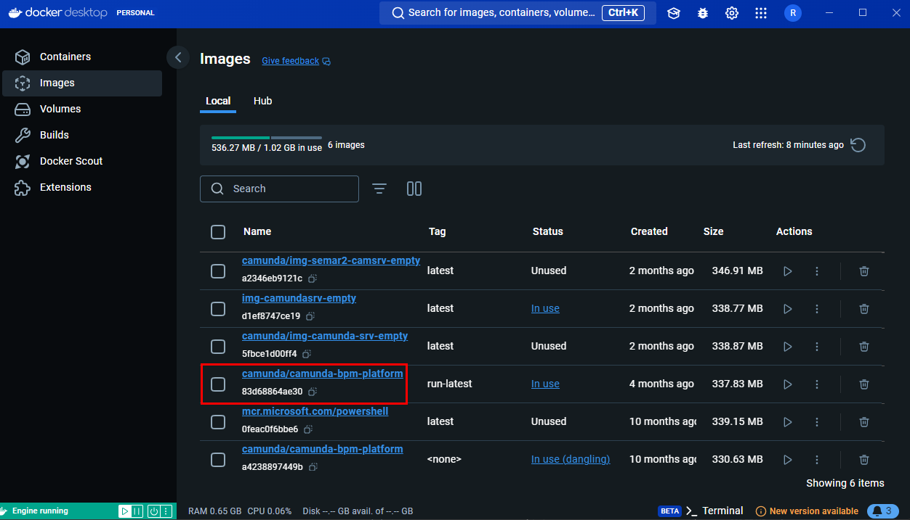
    
- Container-Ansicht in Docker Desktop:  
    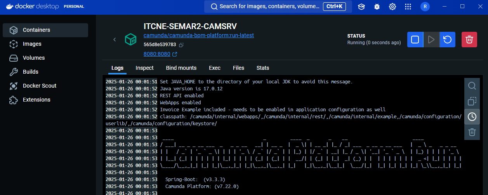
    

**Docker-Befehl zur Container-Erstellung:**

```Terminal
docker run -d --name ITCNE-SEMAR2-CAMSRV -p 8080:8080 camunda/camunda-bpm-platform:run-latest
```

#### **Formular**

Das ursprünglich verwendete Camunda-Formular wurde aufgrund von Problemen mit dem Datumsfeld in ein HTML-Formular umgeschrieben. Dieses HTML-Formular konnte die Anforderungen vollständig erfüllen und ist inzwischen stabil.

**Screenshot des ausgefüllten Formulars:** 
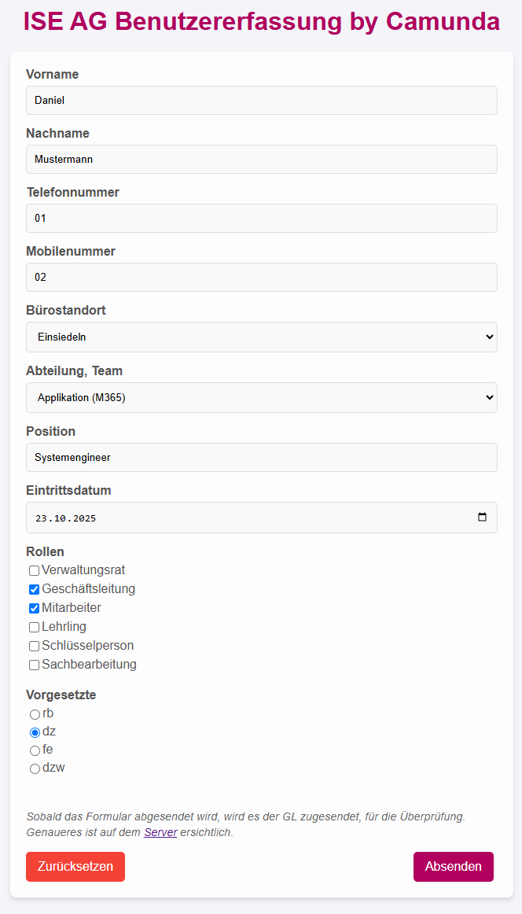

**Statusmeldung beim versenden:**
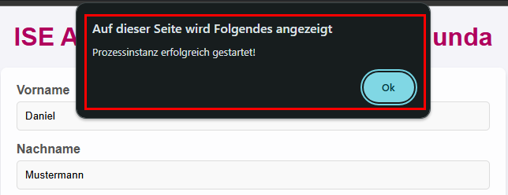

#### **BPMN-Diagramme**

Die BPMN-Diagramme sind der zentrale Bestandteil des Workflows. Sie definieren den Ablauf, von der Datenerfassung bis hin zur Benutzererstellung und der Gruppenzuweisung. Die Diagramme wurden bereits in der [Improve-Phase](./34_verbessern.md#Umsetzung-(Improve)) beschrieben.

#### **Camunda Cockpit**

Das **Camunda Cockpit** wurde verwendet, um den Status der Prozessinstanzen zu überwachen und sicherzustellen, dass diese den vorgesehenen Workflow durchlaufen. Mit den im Cockpit dargestellten **Tokens** lässt sich der aktuelle Status jeder Prozessinstanz visuell nachvollziehen. Dies ist besonders hilfreich, um Fehlerquellen zu identifizieren oder Prozesse zu optimieren.

**Beispiele für Token-Visualisierungen:**

- **Token beim Mitarbeitenden**:  
    Der Prozess hat sich an der Stelle des Mitarbeitenden eingeordnet. Dies zeigt, dass der Prozess die Daten korrekt verarbeitet hat und die nächste Aufgabe (Usertask) bereitsteht.  
    
    
- **Token bei der Geschäftsleitung (GL)**:  
    Hier ist erkennbar, dass der Prozess erfolgreich zur Genehmigung an die Geschäftsleitung übergeben wurde. Die Tokens zeigen den Status an, bevor auf eine Entscheidung gewartet wird.  
    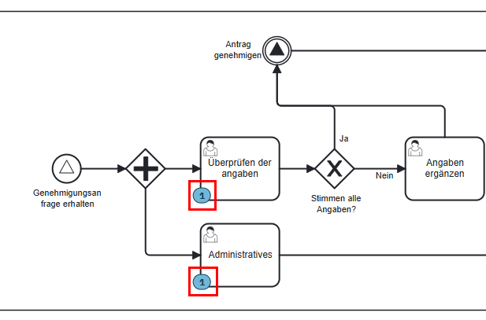
    

**Überprüfung der Variablen in einem Task**:  
Um sicherzustellen, dass die Prozessvariablen korrekt übermittelt werden, können diese direkt in der Camunda-Oberfläche überprüft werden. In diesem Beispiel sind die zuvor eingegebenen Variablen aus dem HTML-Formular sichtbar.  
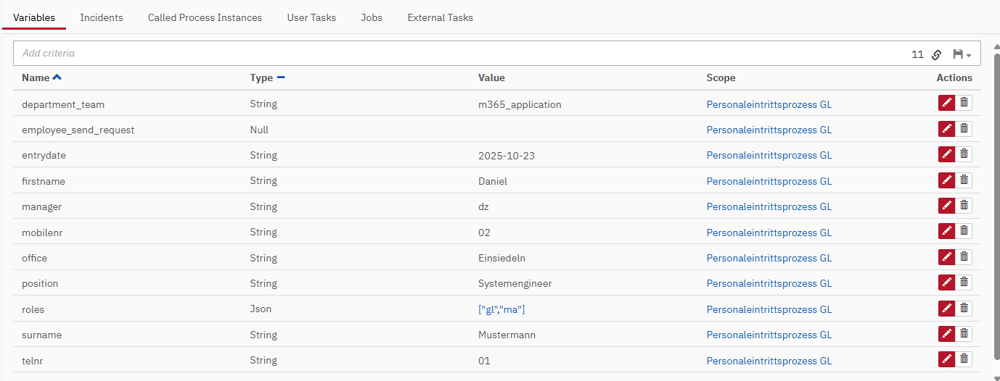  
_Variablen, die aus dem Formular übergeben wurden_

**Übersicht der Tasks für die Geschäftsleitung**:  
Im Cockpit ist ersichtlich, dass der Geschäftsleitung nach dem Prozessstart zwei Usertasks zugewiesen wurden. Diese Tasks können über die Übersicht oder das Taskboard bearbeitet werden.  
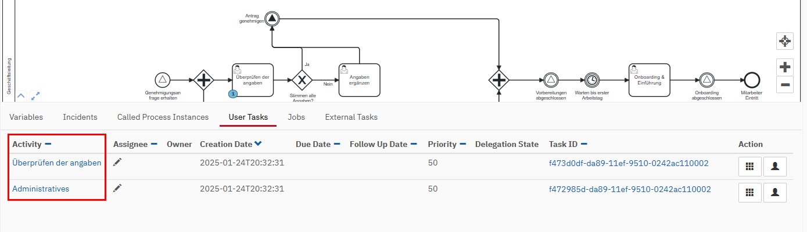  
_Zugewiesene Usertasks für die GL_

**Bearbeitung der Tasks durch die GL**:  
Die Geschäftsleitung kann die Variablen überprüfen und eine Entscheidung treffen (Genehmigung oder Ablehnung). Hier ist der Usertask dargestellt, in dem die GL die Angaben evaluieren und den Antrag annehmen oder ablehnen kann.  
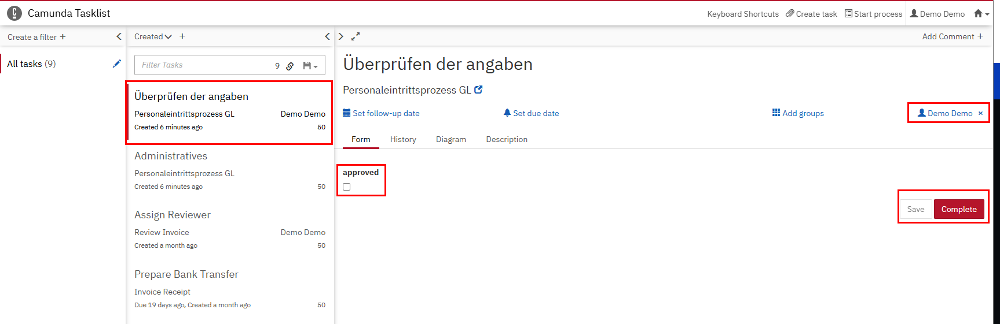  
_Evaluierung der Angaben durch die Geschäftsleitung_

**Bearbeitung abgelehnter Anträge**:  
Falls die GL den Antrag ablehnt, wird automatisch ein weiterer Task erstellt, in dem die Daten angepasst werden müssen. Hier sieht man, wie die GL die Variablen aktualisiert.  
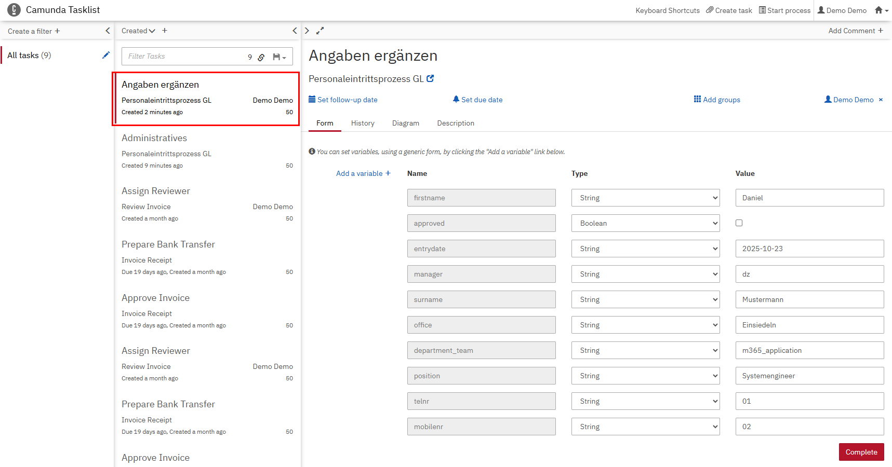  
_Anpassung der Daten durch die Geschäftsleitung_

**Ergebnis nach der Benutzererstellung**:  
Nach der erfolgreichen Erstellung des Benutzers und der Gruppen-Zuweisung werden neue Variablen hinzugefügt, die die Benutzerinformationen enthalten:

- Benutzer ID
- UserPrincipalName
- Passwort

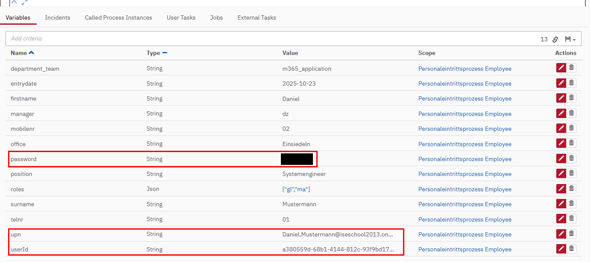  
_Zurückgegebene Variablen nach der Benutzererstellung_

**Timer Intermediate Event**:  
Nach der Benutzererstellung pausiert der Prozess bis zum im Formular angegebenen Datum, das dem ersten Arbeitstag des neuen Mitarbeitenden entspricht. Der Timer wird korrekt mit dem eingegebenen Wert befüllt.  
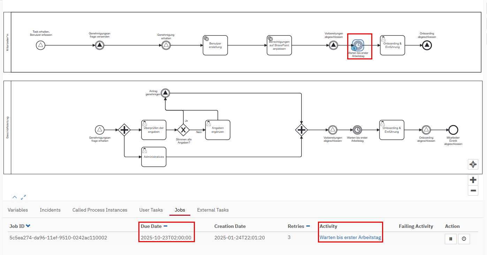  
_Timer Intermediate Event mit Datum_

---

### Scripts

Die Automatisierung der Benutzererstellung und Gruppen-Zuweisung wurde mithilfe von PowerShell-Skripten umgesetzt. Diese Skripte wurden modular aufgebaut und sind vollständig kommentiert, um die Nachvollziehbarkeit zu gewährleisten.

**Verwendete Skripte:**

- Benutzererstellung: [MgGraph_User_Creation.ps1](https://github.com/Radball-Migi/HF-ITCNE24-SemArbeit2-BPMN-Personalprozess/blob/main/ressources/scripts/MgGraph_User_Creation.ps1)
- Anpassung der Berechtigungen: [MgGraph_SP_adjust_permissions.ps1](https://github.com/Radball-Migi/HF-ITCNE24-SemArbeit2-BPMN-Personalprozess/blob/main/ressources/scripts/MgGraph_SP_adjust_permissions.ps1)

---

### Logs

Logs spielen eine wichtige Rolle bei der Fehlerdiagnose und Prozessüberwachung. Während der Skriptausführung werden automatisch Log-Dateien erstellt und gespeichert.

**Speicherort der Logs:**

- `.\Personaleintritt\logs\user_creation-[Datum].log`
- `.\Personaleintritt\logs\sp_rights_customize-[Datum].log`

**Screenshot der Log-Dateien:** 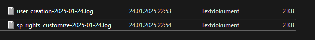

**Beispiel Log Header**

```Text
****************************************************
MgGraph_SP_adjust_permissions.ps1    -    2025-01-24
****************************************************

2025-01-24 22:54:53: Starte FetchAndLock von Tasks...
```

**Beispiel Log-Einträge:**

```Text
2025-01-24 22:50:53: Benutzer Mustermann erfolgreich erstellt. 
2025-01-24 22:53:54: Task abgeschlossen.
```

---

### SharePoint

Zur Validierung der Berechtigungen wurde ein SharePoint-Testportal eingerichtet. Die Berechtigungen werden basierend auf den zugewiesenen Rollen des Benutzers gesteuert.

**Screenshots der Berechtigungen:**

- Berechtigungen auf der Website:
	
	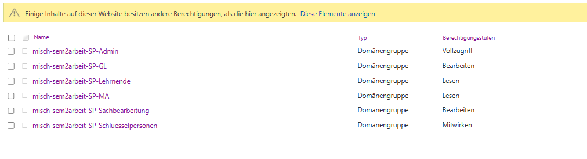
    
- Berechtigungen auf einem Newsbeitrag:
      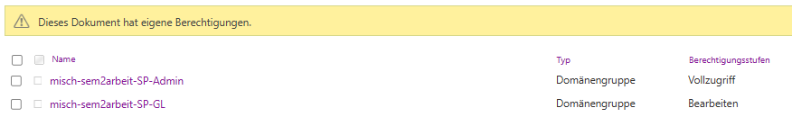
    

**Vergleich zweier Benutzer auf dem SharePoint:**

- **Benutzer Daniel Musterhans** -> Rollen: MA, SB, SP
	
	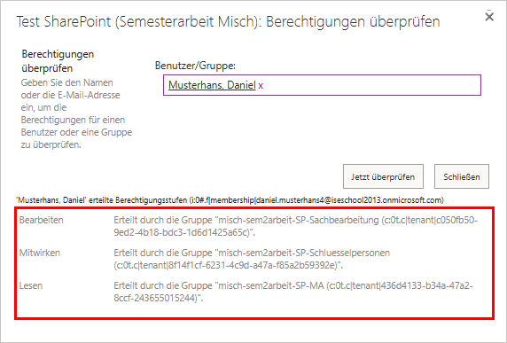
	
	_Berechtigungen auf der Website_
	
	
	
	_Berechtigungen auf Newsbeitrag "Interne Mitteilung – Nur für die Geschäftsleitung"_


- **Benutzer Daniel Mustermann** -> Rollen: GL, MA
	
	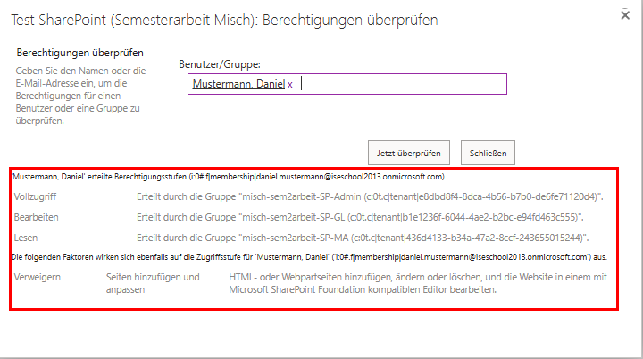
	
	_Berechtigungen auf der Website_
	
	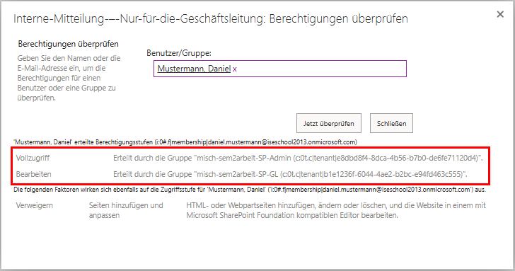
	
	_Berechtigungen auf Newsbeitrag "Interne Mitteilung – Nur für die Geschäftsleitung"_


---

### Entra ID

Die Benutzer- und Gruppenverwaltung wurde über Entra ID (ehemals Azure AD) realisiert. Mithilfe der Skripte werden Benutzer erstellt, Lizenzen zugewiesen und Gruppenmitgliedschaften verwaltet.

**Screenshots in Entra ID:**

- Benutzereigenschaften:  
	
	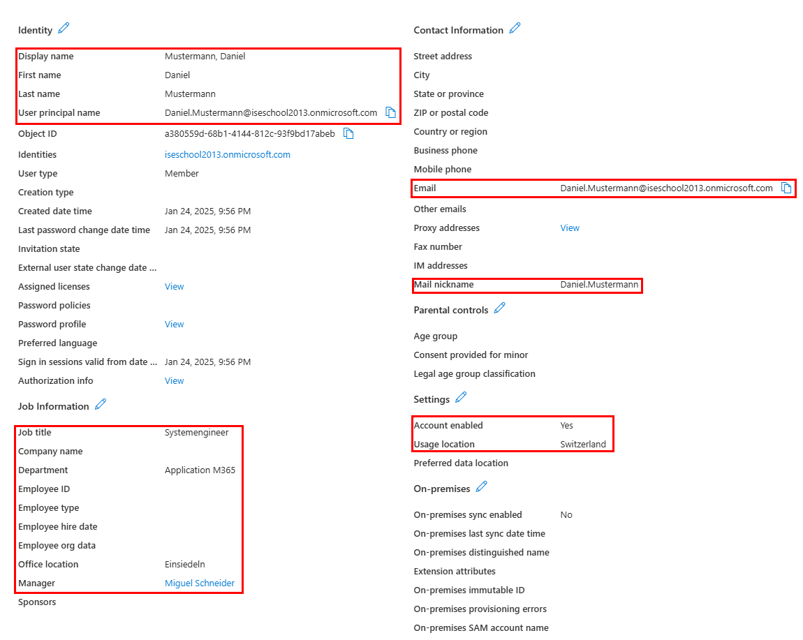
    
- Zugehörige Gruppen:  
	
	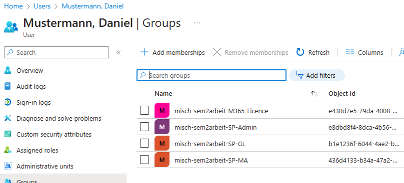
    
- Lizenz Zuweisung:
	
	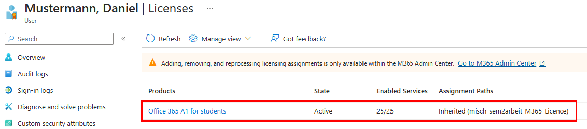
	
- Gruppenzuweisung des Benutzers 
	
	
	

  
---

## Fazit zur Control-Phase

Die Control-Phase hat nachgewiesen, dass der Personalprozess stabil und zuverlässig funktioniert. Durch umfassende Tests konnte sichergestellt werden, dass alle Kernkomponenten – von der Benutzererstellung bis zur Gruppen- und Lizenzverwaltung – einwandfrei arbeiten.

Trotz anfänglicher Herausforderungen, wie Problemen mit dem Datumsfeld und der lokalen Skriptausführung, wurde eine tragfähige Lösung entwickelt. Die nächste Phase sieht eine Migration auf Azure vor, um die Skalierbarkeit und Sicherheit weiter zu verbessern.